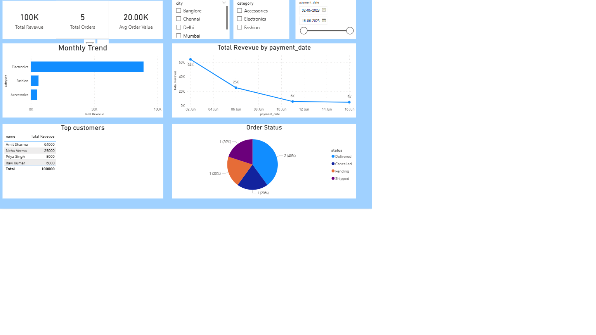

# Ecommerce Sales Analysis (SQL + Power BI)

## Project Overview
This project focuses on analyzing ecommerce sales data using SQL and Power BI. It demonstrates an end-to-end data analysis workflow, including database design, data cleaning, advanced SQL analytics, and interactive dashboard creation.

## Tools & Technologies
- **MySQL**- Database creation and querying
- **SQL**- Joins, aggregations, window functions
- **Power BI**- Dashboard and visualization

## Dataset Description
The dataset consists of five tables:
- Customers
- Products
- Orders
- Order_Items
- Payments

## Project Workflow 
### 1. Basic Analytics
- Used SELECT queries
- Performed basic aggregation
### 2. Data Cleaning
- Handled missing values
- Standardized formats
### 3. Core & Advanced SQL
- Used joins across multiple tables
- Applied GROUP BY and HAVING
- Used window functions
### 4. Advanced Analytics
- Calculated **Revenue**
- Calculated **Profit**
- Calculated **Profit Margin**
- Analyzed monthly trends

## Dashboard Preview

## Conclusion
This project demonstrate the ability to analyze structured data and generate meaningful business insights using SQL and Power BI.

